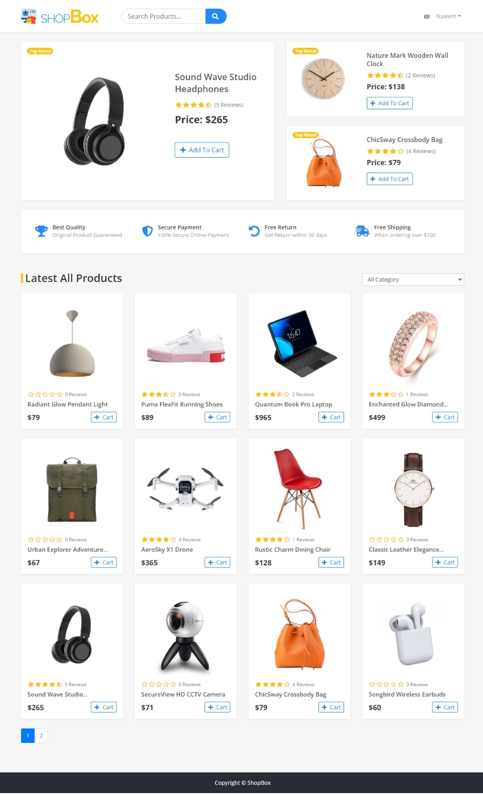

# ShopBox

"ShopBox" is a feature-rich MERN stack e-commerce solution with user authentication, a user-friendly interface, shopping cart, order processing, user profiles, product reviews, with responsive design. Empower your business to thrive online effortlessly.

Let's get started!

## Installation

First you have to clone the repository and install the dependencies:

```bash
   git clone https://github.com/DewmithMihisara/shop-box.git
   cd ShopBox-MERN-Stack-eCommerce
   npm install
```

## Environment

After cloning the project, you need to create a **.env** file in the project directory. You can copy the **.env.example** file and rename it to **.env**. 

```bash
   cp .env.example .env
```

You may change the **.env** file according to your needs. To change the **.env** file, open it with a text editor and change the values of the variables.



## Features

- User Authentication
- Admin Control Panel
- User-Friendly Product Listings
- Shopping Cart
- Order Processing
- User Profile
- Product Reviews and Ratings
- Search and Filtering
- Responsive Design

## Acknowledgements

 - [React](https://react.dev/)
 - [Node](https://nodejs.org/en)
 - [Express](https://expressjs.com/)
 - [MongoDB](https://www.mongodb.com/)
 - [Mongoose](https://mongoosejs.com/)
